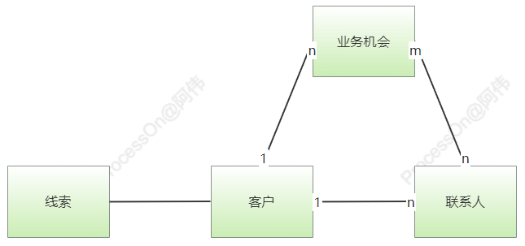
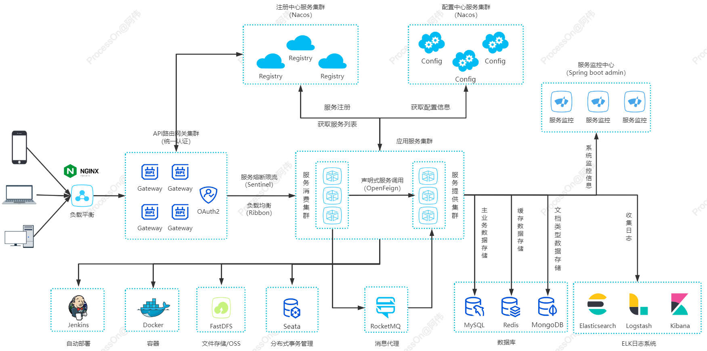
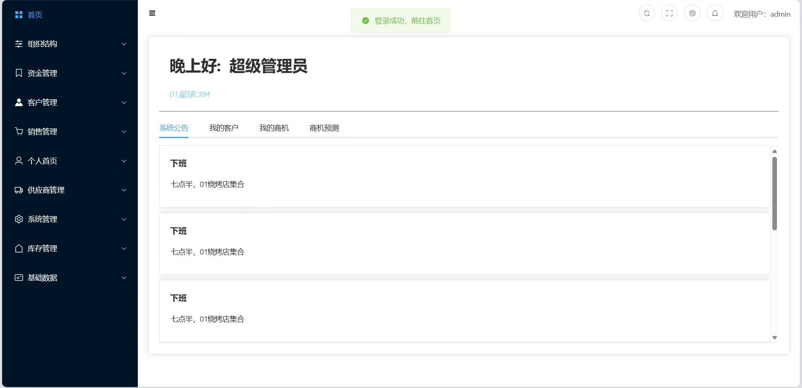
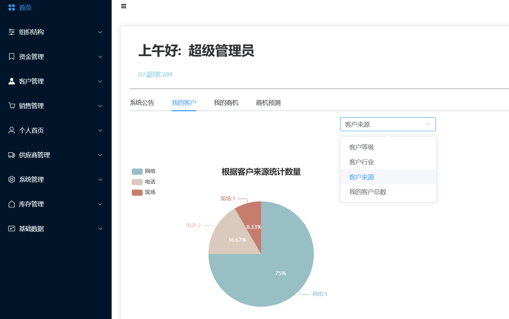
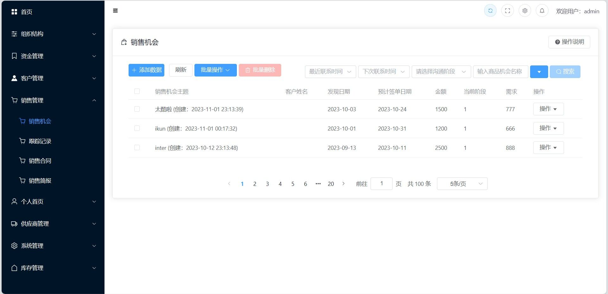
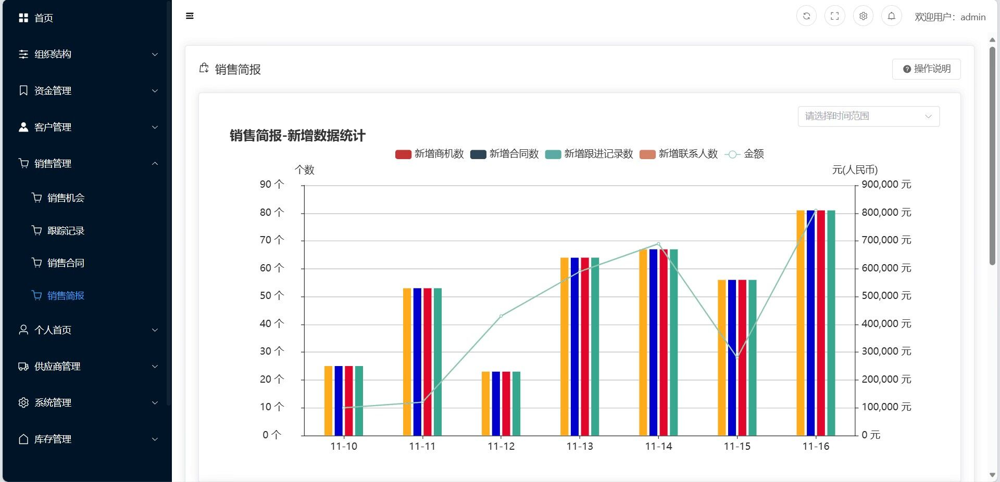

# `zero-one-crmsys`

CRM相关概念参考：

- https://baike.baidu.com/item/%E5%AE%A2%E6%88%B7%E5%85%B3%E7%B3%BB%E7%AE%A1%E7%90%86/254554
- https://wiki.mbalib.com/wiki/%E5%AE%A2%E6%88%B7%E5%85%B3%E7%B3%BB%E7%AE%A1%E7%90%86
- https://www.oracle.com/cn/cx/what-is-crm/#link16

CRM系统核心对象是客户、线索、联系人、业务机会，这四者之间的对应关系如下：

- **客户**
  - 发生交易行为的主体。
  - 在不同的行业以及不同的环节中，客户所对应的对象不同，可以是某个组织也可以是个人，并且能够具有一定的组织架构。
- **线索（潜在客户）**
  - 是可能会发生交易的对象或者对象资料。
  - 线索可以通过业务机会转换为客户，而线索转化为客户的过程就是线索的转换过程。
- **联系人**
  - 与企业交互的主体，对交易有影响的人，也可以是业务对接人。
  - 联系人可能就是客户本身，也可能是其他（比如某企业准备采购一批硬盘，客户就是企业这个组织，但是联系人可能是采购员、也可能是财务专员，与企业组织结构有关）。
- **业务机会（商机）**
  - 产生交易的机会。
  - 业务机会来源于客户，一个客户可能有多次交易，业务机会就是每一次客户想要购买某个产品或服务的意向，也是完成销售业绩的开端。

## 项目简介

`zero-one-crmsys`是一款创新型客户关系管理软件，专为现代企业的增长和竞争优势而设计。它提供了一套全面的工具和功能，使企业能够深入了解客户需求、提供卓越的服务、拓展市场份额，以及实现高效的销售和营销策略。

本系统适用各类行业，主要针对中小型销售/售后服务团队，该系统支持客户资料自定义配置、查询。

**主要功能和特点：**

- **360度客户视图：** 通过集成各个渠道的数据，为企业提供全面的客户视图，帮助他们更好地了解客户的需求和行为。
- **销售自动化：** 自动化销售流程，包括线索跟进、销售机会管理、报价和订单处理，提高销售效率，减少错误。
- **客户服务和支持：** 提供多渠道客户服务和支持，包括在线聊天、电子邮件和电话支持，确保客户满意度和忠诚度。
- **移动应用支持：** 提供移动应用程序，使销售团队和客户支持人员能够在任何地方访问关键数据和工具。
- **弹性和可扩展性：** 基于微服务架构，系统具有强大的弹性和可扩展性，可以适应不断变化的业务需求。
- **智能分析和洞察：** 利用先进的数据分析和机器学习算法，系统可以为企业提供深刻的市场洞察，帮助他们优化营销策略和产品开发。

**业务价值：**

- **客户增长：** 通过更好地了解客户需求和提供卓越的服务，企业可以吸引更多客户，实现持续的增长。
- **销售扩张：** 自动化销售流程和智能洞察帮助销售团队更快地关闭交易，扩展市场份额。
- **数据驱动决策：** 数据分析和智能洞察使企业能够制定更明智的决策，优化资源分配，并预测市场趋势。
- **客户满意度提高：** 通过提供更好的客户服务和支持，CRM系统可以提高客户满意度，增强客户忠诚度。

## 系统架构图

项目主体骨架基于`Spring Cloud Alibaba`生态体系，使用`MySQL`进行数据持久化管理，采用`Vue3`生态体系与`Element Puls UI`框架完成前端制作，同时项目提供`C++`微服务开发解决方案与集成、使用`Jenkins`实现`CD/CI`。

## 项目结构说明
> `zero-one-crmsys`  
>
> > `.gitignore` -- 忽略提交配置
> >
> > `README.md` -- 项目自述文件
> >
> > `documents` -- 环境搭建、编码规范、项目需求等等文档资源
> >
> > `crm-java` -- `Java`项目主体
> >
> > `crm-cpp` -- `C++`项目主体
> >
> > `crm-frontend` -- 前端项目主体

## 软件架构

### `Java`技术栈

#### 后端核心技术栈

版本匹配参考：

https://github.com/alibaba/spring-cloud-alibaba/wiki/%E7%89%88%E6%9C%AC%E8%AF%B4%E6%98%8E

| 技术                     | 说明                   | 版本          | 备注                                                         |
| ------------------------ | ---------------------- | ------------- | ------------------------------------------------------------ |
| `Spring`                 | 容器                   | 5.2.15        | https://spring.io/                                           |
| `Spring Web MVC`         | `MVC`框架              | 5.2.15        | https://docs.spring.io/spring/docs/current/spring-framework-reference/web.html |
| `Beanvalidation`         | 实体属性校验           | 2.0.2         | https://beanvalidation.org/2.0-jsr380/ https://www.baeldung.com/spring-boot-bean-validation |
| `MyBatis`                | `ORM`框架              | 3.5.7         | http://www.mybatis.org/mybatis-3/zh/index.html               |
| `MyBatis Plus`           | `MyBatis`的增强工具    | 3.4.3.4       | https://baomidou.com/                                        |
| `MyBatis Plus Generator` | 代码生成器             | 3.5.1         | https://github.com/baomidou/generator                        |
| `Druid`                  | 数据库连接池           | 1.2.8         | https://github.com/alibaba/druid                             |
| `Lombok`                 | 实体类增加工具         | 1.18.20       | https://github.com/rzwitserloot/lombok                       |
| `Hutool`                 | Java工具类库           | 5.8.3         | https://hutool.cn/docs/#/                                    |
| `Knife4j`                | 接口描述语言           | 2.0.8         | https://gitee.com/xiaoym/knife4j                             |
| `Nimbus JOSE JWT`        | `JSON Web Token`       | 8.21          | https://bitbucket.org/connect2id/nimbus-jose-jwt/wiki/Home   |
| `Spring Boot`            | Spring快速集成脚手架   | 2.3.12        | https://spring.io/projects/spring-boot                       |
| `Spring Cloud`           | 微服务框架             | `Hoxton.SR12` | https://spring.io/projects/spring-cloud                      |
| `Spring Cloud Alibaba`   | 微服务框架             | 2.2.8         | https://github.com/alibaba/spring-cloud-alibaba/wiki         |
| `Spring Cloud Security`  | 认证和授权框架         | 2.2.5         | https://spring.io/projects/spring-cloud-security             |
| `Sentinel`               | 分布式系统的流量防卫兵 | 1.8.4         | https://sentinelguard.io/zh-cn/                              |
| `Seata`                  | 分布式事务解决方案     | 1.5.1         | https://seata.io/zh-cn/                                      |
| `MapStruct`              | 实体类映射代码生成器   | `1.5.3.Final` | https://mapstruct.org/                                       |

#### 后端扩展技术栈

版本匹配参考：

https://docs.spring.io/spring-data/elasticsearch/docs/current/reference/html/#preface.requirements

https://docs.spring.io/spring-data/mongodb/docs/current/reference/html/#requirements

| 技术                       | 说明                   | 版本   | 备注                                                         |
| -------------------------- | ---------------------- | ------ | ------------------------------------------------------------ |
| `EasyExcel`                | Excel报表              | 3.0.5  | https://github.com/alibaba/easyexcel                         |
| `RocketMQ`                 | 消息队列中间件         | 4.9.3  | https://github.com/alibaba/spring-cloud-alibaba/wiki/RocketMQ |
| `WebSocket`                | 及时通讯服务           | 5.2.15 | https://docs.spring.io/spring-framework/docs/5.3.15/reference/html/web.html#websocket |
| `FastDFS`                  | `dfs`客户端            | 2.0.1  | https://gitee.com/zero-awei/fastdfs-spring-boot-starter      |
| `Elasticsearch`            | 分布式搜索和分析引擎   | 7.6.2  | https://www.elastic.co/guide/en/elasticsearch/reference/7.6/index.html |
| `LogStash`                 | 日志收集工具           | 7.6.2  | https://www.elastic.co/guide/en/logstash/7.6/index.html      |
| `Kibana`                   | 日志可视化查看工具     | 7.6.2  | https://www.elastic.co/guide/en/kibana/7.6/index.html        |
| `logstash-logback-encoder` | `Logstash`日志收集插件 | 6.6    | https://github.com/logfellow/logstash-logback-encoder/tree/logstash-logback-encoder-6.6 |
| `spring-boot-admin`        | 服务管理和监控面板     | 2.3.1  | https://github.com/codecentric/spring-boot-admin             |
| `EasyEs`                   | `ES ORM`开发框架       | 1.0.3  | https://www.easy-es.cn/                                      |
| `spring-data-mongodb`      | `Spring`集成`MongoDB`  | 3.0.9  | https://docs.spring.io/spring-data/mongodb/docs/3.0.9.RELEASE/reference/html/#preface |
| `AJ-Captcha`               | 验证码插件             | 1.3.0  | https://ajcaptcha.beliefteam.cn/captcha-doc/                 |

### 前端技术栈

#### 核心技术栈

| 技术           | 说明             | 版本                                                         | 备注                                 |
| -------------- | ---------------- | ------------------------------------------------------------ | ------------------------------------ |
| `Vue`          | 前端框架         | `v3.x`                                                       | https://v3.vuejs.org/                |
| `Vue-Router`   | 路由框架         | `v4.x`                                                       | https://next.router.vuejs.org/       |
| `Pinia`        | 全局状态管理框架 | `v2.x`                                                       | https://pinia.vuejs.org/             |
| `Axios`        | HTTP中间件       | [`v0.27.2`](https://github.com/axios/axios/releases/tag/v0.27.2) | https://github.com/axios/axios       |
| `Element-Plus` | 前端`UI`框架     | `latest`                                                     | https://element-plus.gitee.io/zh-CN/ |

#### 扩展技术栈

| 技术                 | 说明                    | 版本     | 备注                                                         |
| -------------------- | ----------------------- | -------- | ------------------------------------------------------------ |
| `Avue`               | 基于`ElementUI`二次封装 | `v3.1.4` | https://v3.avuejs.com/                                       |
| `V-Charts`           | 基于`Echarts`的图表框架 | latest   | https://v-charts.js.org/                                     |
| `AJ-Captcha`         | 验证码插件              | 1.3.0    | https://ajcaptcha.beliefteam.cn/captcha-doc/                 |
| `SheetJS`            | 电子表格插件            | 0.19.2   | https://docs.sheetjs.com/docs/ https://docs.sheetjs.com/docs/demos/frontend/vue |
| `vue-plugin-hiprint` | 打印插件                | 0.0.48   | https://gitee.com/CcSimple/vue-plugin-hiprint                |
| `wangEditor`         | 富文本编辑器            | v5       | https://www.wangeditor.com/v5/                               |

### `CPP`技术栈

#### 后端核心技术栈

| 技术              | 说明               | 版本                                                   | 备注                                                         |
| ----------------- | ------------------ | ------------------------------------------------------ | ------------------------------------------------------------ |
| oat++             | Web框架            | `1.3.0`                                                | https://github.com/oatpp/oatpp                               |
| `MySQL Connector` | `MySQL`连接驱动库  | 8.0.27                                                 | https://dev.mysql.com/downloads/connector/cpp/ https://dev.mysql.com/doc/connector-cpp/1.1/en/connector-cpp-apps.html |
| `JWT`             | `JSON` Web Token   | [v1.4](https://github.com/arun11299/cpp-jwt/tree/v1.4) | https://opensourcelibs.com/lib/cpp-jwt                       |
| `OpenSSL`         | 开源安全套接层协议 | `1.1.1L`                                               | https://www.openssl.org/ https://www.xolphin.com/support/OpenSSL/OpenSSL_-_Installation_under_Windows |

#### 后端扩展技术栈

| 技术       | 说明              | 版本     | 备注                                          |
| ---------- | ----------------- | -------- | --------------------------------------------- |
| `xlnt`     | excel报表         | 1.5.0    | https://github.com/tfussell/xlnt              |
| `fastdfs`  | 文件存储客户端    | latest   | https://gitee.com/fastdfs100                  |
| `yaml-cpp` | 解析`yaml`数据    | 0.7.0    | https://github.com/jbeder/yaml-cpp            |
| `nacos`    | `nacos`客户端     | `v1.1.0` | https://github.com/nacos-group/nacos-sdk-cpp  |
| `redis++`  | `redis`连接客户端 | 1.3.2    | https://github.com/sewenew/redis-plus-plus    |
| `rocketmq` | `rokcetmq`客户端  | 2.1.0    | https://github.com/apache/rocketmq-client-cpp |
| `mongo`    | `mongodb`客户端   | 3.6.5    | https://www.mongodb.com/docs/drivers/cxx/     |

#### 测试前端技术栈

| 技术         | 说明       | 版本  | 备注                            |
| ------------ | ---------- | ----- | ------------------------------- |
| `jQuery`     | Ajax框架   | 3.6.0 | https://jquery.com/             |
| `HTML5`      | 文本页面   | 5     | https://www.w3schools.com/html/ |
| `CSS3`       | 页面样式表 | 3     | https://www.w3schools.com/css/  |
| `JavaScript` | 页面小脚本 | `ES6` | https://www.w3schools.com/js/   |

## 环境要求

### 开发工具

| 工具            | 说明                  | 版本      | 备注                                                         |
| --------------- | --------------------- | --------- | ------------------------------------------------------------ |
| `Navicat`       | 数据库连接工具        | latest    | https://www.navicat.com.cn/                                  |
| `RDM`           | `Redis`可视化管理工具 | latest    | https://github.com/uglide/RedisDesktopManager https://gitee.com/qishibo/AnotherRedisDesktopManager |
| `PowerDesigner` | 数据库设计工具        | 16.6      | http://powerdesigner.de/                                     |
| `Axure`         | 原型设计工具          | 9         | https://www.axure.com/                                       |
| `MindMaster`    | 思维导图设计工具      | latest    | http://www.edrawsoft.cn/mindmaster                           |
| `Visio`         | 流程图绘制工具        | latest    | https://www.microsoft.com/zh-cn/microsoft-365/visio/flowchart-software |
| `Apipost`       | `API`接口调试工具     | latest    | https://www.apipost.cn/                                      |
| `Mock.js`       | `API`接口模拟测试     | latest    | http://mockjs.com/                                           |
| `Git`           | 项目版本管控工具      | latest    | https://git-scm.com/                                         |
| `Codeup`        | 项目源码托管平台      | latest    | https://codeup.aliyun.com                                    |
| `Projex`        | 开发过程管控平台      | latest    | https://devops.aliyun.com/projex                             |
| `IDEA`          | `Java`开发`IDE`       | 2022.1.3+ | https://www.jetbrains.com/idea/download                      |
| `Apache Maven`  | Maven 构建工具        | 3.6.3     | https://maven.apache.org/                                    |
| `Docker Maven`  | Maven Docker插件      | 0.40.2    | https://dmp.fabric8.io/ https://github.com/fabric8io/docker-maven-plugin |
| `VS`            | `C++`开发`IDE`        | 2022      | https://learn.microsoft.com/en-us/visualstudio/releases/2022/release-notes |
| `Cmake`         | `C++`跨平台编译       | latest    | https://cmake.org/cmake/help/latest/index.html               |

### 开发环境

| 依赖环境  | 版本       | 备注                      |
| --------- | ---------- | ------------------------- |
| `Windows` | 10+        | 操作系统                  |
| `JDK`     | 1.8.0_191+ | https://www.injdk.cn/     |
| `NodeJS`  | 16.17.0    | https://nodejs.org/zh-cn/ |
| `NPM`     | 8.19.2     | https://www.npmjs.com/    |

### 服务器环境

| 依赖环境    | 版本                                                         | 备注                                                         |
| ----------- | ------------------------------------------------------------ | ------------------------------------------------------------ |
| `Anolis OS` | `8.6GA`                                                      | https://openanolis.cn/anolisos                               |
| `Docker`    | latest                                                       | https://www.docker.com/                                      |
| `MySQL`     | 8.0.20                                                       | https://www.mysql.com/cn/                                    |
| `Redis`     | 6.2.7                                                        | https://redis.io/                                            |
| `Nacos`     | 2.1.0                                                        | https://nacos.io/zh-cn/docs/quick-start-docker.html          |
| `Sentinel`  | 1.8.4                                                        | https://github.com/alibaba/Sentinel/releases                 |
| `Seata`     | 1.5.1                                                        | https://github.com/seata/seata                               |
| `RocketMQ`  | 4.9.3                                                        | https://rocketmq.apache.org/                                 |
| `Nginx`     | latest                                                       | https://nginx.org/en/                                        |
| `FastDFS`   | [V6.07](https://github.com/happyfish100/fastdfs/releases/tag/V6.07) | https://gitee.com/fastdfs100                                 |
| `ELK`       | 7.6.2                                                        | https://www.elastic.co/guide/en/elastic-stack/7.6/index.html |
| `MongoDB`   | 4.4.17                                                       | https://www.mongodb.com/try/download/community               |
| `Jenkins`   | latest                                                       | https://www.jenkins.io/zh/doc/book/installing/               |

## 效果预览

登录

首页

销售

## 特别鸣谢

`zero-one-crmsys`的诞生离不开开源软件和社区的支持，感谢以下开源项目及项目维护者：

- `spring`：https://github.com/spring-projects
- `alibaba`：https://github.com/alibaba
- `mybatis`：https://github.com/mybatis/mybatis-3.git
- `mp`：https://github.com/baomidou
- `api`：https://gitee.com/xiaoym/knife4j
- `vue`：https://github.com/vuejs
- `ui`：https://github.com/ElemeFE
- `oatpp`：https://github.com/oatpp/oatpp
- `业务参考项目`：https://gitee.com/07fly/FLY-CRM

同时也感谢其他没有明确写出来的开源组件提供给与维护者。

## 支持一下

如果觉得框架和项目还不错，点个⭐Star，这将是对**01星球**极大的鼓励与支持。

想了解更多关于计算机方向选择、学习建议等相关信息，可以关注[**01星球B站主页~**](https://space.bilibili.com/1653229811?spm_id_from=333.1007.0.0)